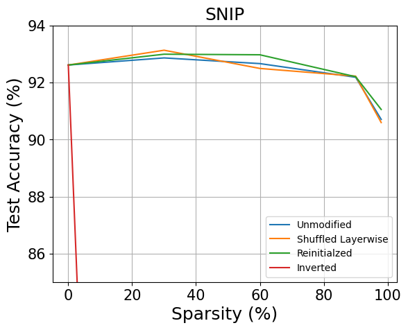
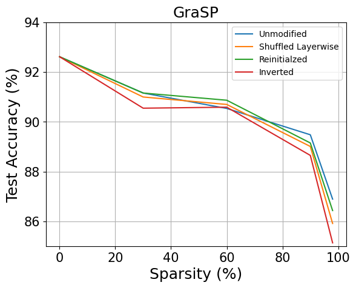
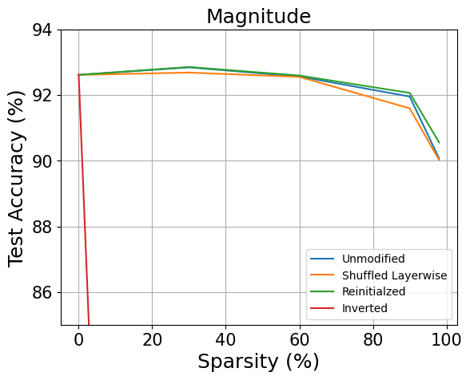
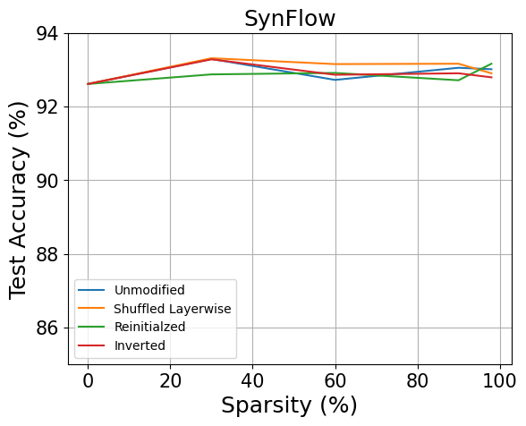

# PRUNING-NEURAL-NETWORKS-AT-INITIALIZATION-WHY-ARE-WE-MISSING-THE-MARK

## Members

- Tunchanok Ngamsaowaros   tn1u22@soton.ac.uk

- Pooja Vijayakumar        pv1n21@soton.ac.uk

- Juran Guo                jg4n22@soton.ac.uk

## Overview

In this work, works of <a href="https://arxiv.org/abs/2205.09328" target="_blank">Pruning Neural Networks at Initialization: Why are We Missing the Mark?</a> are reproduced. Three pruning methods on VGG16 on CIFAR10 (GraSP: `/trials/grasp`, SNIP: `/trials/SNIP`, Magnitude: `/trials/magnitude`, SynFlow: `trials/synflow`) are implemented. In each trial, the pruned model is trained 80 epochs to observe performance.

The results are the same as the original paper except the results of the inversion method. When applying inversion on SynFlow and GraSP, the trends of testing accuracy are not in the same as the guess, which should be decreasing sharply. The trends still increase. This needs further researches.

## How to Run

### Resources

PyTorch >= 1.4.0

Torchvision >= 0.5.0

Torchbearer

GPU (if available, suggest) (in this work, GPU P100 from Kaggle free resources is used)

### Run each trial

Simply access to `/SNIP` or `/grasp` or `/magnitude` or `/synflow` in `trials/`, then follow the instructions. All codes are inside.

## Results

  
  
  
  
  
Test Accuracy of Ablations on Pruning Methods

## Reference

[1] Frankle, Jonathan, et al. "Pruning neural networks at initialization: Why are we missing the mark?." arXiv preprint arXiv:2009.08576 (2020). https://doi.org/10.48550/arXiv.2009.08576

[2] Tanaka, Hidenori, et al. "Pruning neural networks without any data by iteratively conserving synaptic flow." Advances in neural information processing systems 33 (2020): 6377-6389. https://doi.org/10.48550/arXiv.2006.05467

[3] Wang, Chaoqi, Guodong Zhang, and Roger Grosse. "Picking winning tickets before training by preserving gradient flow." arXiv preprint arXiv:2002.07376 (2020). https://doi.org/10.48550/arXiv.2002.07376

## Link

[1] ganguli-lab/Synaptic-Flow: https://github.com/ganguli-lab/Synaptic-Flow

